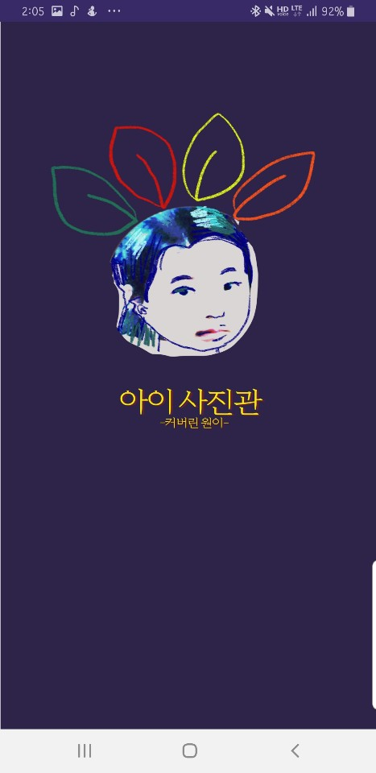
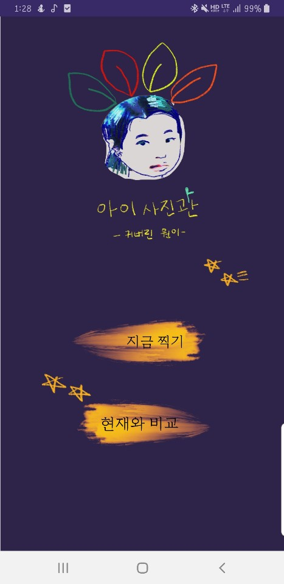

# AgingApp
<h2> '아이 사진관' Android Application </h2>
<h3>/ 실종아동의 현재 나이 이미지 생성 및 찾기 프로젝트 (딥러닝 GAN 기반) 
  -> Face Aging Gan기반의 아동의 나이 든 모습 생성 모바일 어플리케이션 </h3>
 

### ● Purpose
현재까지 실종 아동을 찾을 수 있는 대부분의 방법은 실종 당시의 사진을 전단지나 tv매체 를 통해 알리는 것이다.  
그러나 장기 실종자의 경우 실종 당시의 사진만으로 찾기에는 많은 어려움이 있다. 실종아동의 성장 후 모습을 예측하여 찾는 시스템이 필요하지만 
현재 노화 기술의 정확도로는 한계가 있다.  
노화기술의 정확도 향상을 위한 데이터를 수집할 수 있는 어플리케이션을 개발하였고 이 기능을 구현하기 위해 Face-Aging GAN기반의 IPCGAN을 이용하였다.   

※ 사용자가 5,6,7세 아동의 모습을 촬영하거나 사진을 첨부 하면 해당 상세정보는 메인 서버로 전송되어 16~19세의 나이대로 노화된 모습의 결과물을 생성한다.  
해당 생성된 사진을 다시 앱으로 전송하여 사용자가 현재의 모습과 비교할 수 있고 화면 하단의 공유 버튼을 누르면 원하는 공유 수단을 이용하여 
사진을 전송할 수 있다.  

  
### ● UI images
크게는 2가지 기능으로,  
- 5~7세의 사용자가 정면의 모습을 촬영하면 메인서버에서 IPCGAN을 거쳐 15~19세의 노화된 모습의 결과물을 받는 노화 카메라 기능 
- 5~7세의 모습과 15~19세의 모습, 총 2장의 사진을 첨부하여 변환된 모습과 실제 모습을 비교해볼 수 있는 기능 
각 기능에 대한 예시 UI를 첨부하였다.
   {: width="10px" height="50px"}    
    
  

### ● data
지금까지 확보한 데이터 셋입니다.  
(전체 데이터셋을 용량 및 저작권 문제로 업로드가 되지 않아 데이터셋별로 예시 이미지를 첨부하였습니다.)

### ● family classifier
이 폴더에 있는 코드는 IPCGAN에 통합할 Family Classifier의 모델, Family Classifier 데이터를 만들기 위한 딥러닝 모듈인 Face Point Detection 모듈에 대한 코드입니다.

### ● test case
IPCGAN의 test 결과입니다. 이에따라 데이터셋의 변화를 주기로 했습니다.
